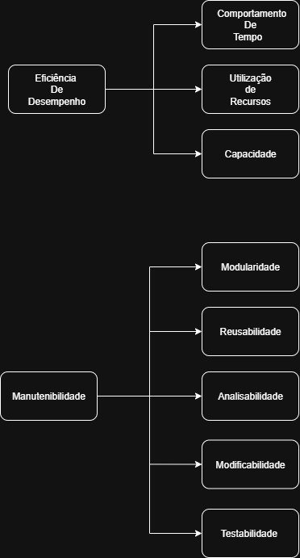

# Fase 1 – Processo de Avaliação

## **Contexto de Trabalho**

Este trabalho foi desenvolvido no âmbito da disciplina de **Qualidade de Software**, com o objetivo de proporcionar aos alunos a compreensão, do início ao fim, da execução de um processo de avaliação de um produto de software, aplicando conceitos, metodologias e normas padronizadas e reconhecidas internacionalmente. 

## **Software Escolhido**

O software escolhido para a realização do trabalho é o [**ChamaControl [1]**](#referencias-bibliograficas), criado por estudantes da disciplina de Métodos de Desenvolvimento de Software da Universidade de Brasília. Os estudantes atuaram como **responsáveis** pela implementação técnica do sistema e também como **operadores** durante a execução acadêmica, cuidando da infraestrutura e manutenção básica. 

A disponibilização do software ocorreu de forma aberta, em repositório público, o que permite classificá-los também como **fornecedores** da solução. A avaliação é conduzida por estudantes da disciplina de Qualidade de Software, sendo essa avaliação requisitada pela professora da turma. 

Os usuários finais abrangem cidadãos em geral, pesquisadores, órgãos públicos e organizações ambientais, todos interessados em acessar informações atualizadas sobre queimadas de forma simples e confiável.

| **Nome do produto** | **Versão do produto**             |
|---------------------|-----------------------------------|
| ChamaControl        | v1.0.0 (Versão inicial acadêmica) |

#### **Domínio de Aplicação**

O sistema se insere no domínio de **monitoramento ambiental**, oferecendo uma interface web intuitiva para a consulta de dados públicos do **INPE** relacionados a focos de incêndio no Brasil. O ChamaControl organiza informações de forma estruturada e acessível, permitindo acompanhar tanto os registros anuais de queimadas quanto os focos diários mais recentes, atualizados todos os dias às 10h com base em arquivos disponibilizados pelo INPE.

#### **Classificação Técnica**

Assim, o ChamaControl foi classificado como **Software de Tempo Real** conforme Pressman (2002), devido à sua função de monitoramento contínuo de incêndios e necessidade de resposta em tempo útil.

#### **Funcionalidades do Sistema**

Além dos **dashboards interativos**, o sistema incorpora uma tela dedicada a notícias sobre queimadas, alimentada por meio da **API do GNews**, fornecendo informações complementares e contextualizadas sobre os eventos monitorados.

Para manter a base de dados atualizada, o ChamaControl conta com **três scrapers principais**:

- **processaDadosAnual**, que popula o banco de dados com registros históricos entre 2003 e 2024;
- **processaDadosDiarios30Dias**, que insere os focos registrados diariamente nos últimos 30 dias;
- **processaDadoDiario**, responsável por atualizar a aplicação diariamente com os dados mais recentes.

#### **Objetivo da avaliação**

A análise de qualidade do ChamaControl busca verificar se o sistema atende aos padrões definidos pelo modelo ISO/IEC 25010, considerando atributos como Eficiência de Desempenho e Manutenibilidade.

Entre os objetivos específicos destacam-se:
Avaliar se o sistema utiliza os recursos computacionais de forma adequada e se responde dentro de prazos aceitáveis, considerando seu propósito de monitoramento ambiental;

Identificar melhorias que possam otimizar o tempo de resposta, a utilização de recursos e a capacidade do sistema;

Examinar o grau de modularidade, testabilidade e modificabilidade do software, verificando se sua estrutura favorece manutenção e evolução;

Produzir um diagnóstico técnico direcionado a essas duas características, servindo como base para ajustes futuros e comparações com sistemas de propósito semelhante.

## Classificação e Ênfase das Características de Qualidade

Nesta etapa inicial do processo de avaliação, foram definidas as características de qualidade a serem analisadas com base nos objetivos do trabalho e no perfil do público-alvo do ChamaControl. A escolha levou em conta tanto a necessidade de garantir o bom desempenho do sistema quanto a importância de facilitar sua manutenção e evolução futura.

Foram priorizadas as características de Eficiência de Desempenho e Manutenibilidade, pois estão diretamente ligadas à capacidade do sistema de processar e apresentar dados atualizados do INPE em tempo adequado, além de permitir que sua estrutura seja mantida e modificada de forma confiável pelos desenvolvedores.

A seguir, apresenta-se a classificação das características de qualidade, conforme a abordagem SQuaRE (ISO/IEC 25010), em uma escala de 1 a 5:

| Característica           | Ênfase (1-5)         |
| ------------------------ | -------------------- |
| Eficiência de Desempenho | 5 – Alta prioridade  |
| Manutenibilidade         | 5 – Alta prioridade  |
| Usabilidade              | 4 – Média prioridade |
| Confiabilidade           | 2 – Baixa prioridade |
| Segurança                | 1 – Baixa prioridade |
| Compatibilidade          | 1 – Baixa prioridade |
| Portabilidade            | 1 – Baixa prioridade |
| Funcionalidade           | 1 – Baixa prioridade |

Essa priorização servirá como base para a definição das métricas e critérios de avaliação, garantindo foco nos aspectos mais relevantes para a análise do sistema.

## Escopo, Profundidade e Objetos de Avaliação

### Escopo
A avaliação abrangerá os **principais módulos** do sistema **ChamaControl**, a saber:

- **Coleta de dados**: Scrapers responsáveis pela importação e atualização de dados do INPE (.csv) e do GNews (notícias).  
- **Armazenamento**: Estrutura de persistência em banco de dados MySQL.  
- **API Backend**: Endpoints em Node.js/Express responsáveis por fornecer dados processados.  
- **Front-end**: Interface desenvolvida em React/Vite, incluindo componentes, rotas e visualizações gráficas.  

**Fora do escopo** (não serão avaliados nesta fase):  
- Configurações de infraestrutura (Docker e docker-compose).  
- Ferramentas externas de teste/documentação (Postman, Swagger).  

### Profundidade
O nível de análise será **intermediário**, contemplando:  
- Verificação de corretude das principais funcionalidades (coleta, armazenamento, exibição e consumo de API).  
- Testes funcionais de cenários típicos (visualização de gráficos, acesso às notícias, chamadas básicas à API).  
- Checagem de consistência entre dados coletados e exibidos.  

**Não serão realizados**:  
- Testes extensivos de performance.  
- Testes de segurança avançada.  
- Análises profundas de logs de execução.  

### Objetos de Avaliação
**Funcionalidades específicas**:  
- Execução diária do scraper.  
- Consulta de dados históricos e recentes via API.  
- Renderização de gráficos de focos de incêndio no front-end.  
- Exibição de notícias atualizadas sobre queimadas.  

**Fluxos principais de usuário**:  
- Acesso à interface web (navegação entre páginas).  
- Consulta e interpretação de dados apresentados em gráficos.  
- Visualização de notícias integradas ao sistema.  

## ODS Relacionados e Metas Associadas

A avaliação do **ChamaControl** também se conecta a objetivos mais amplos, especialmente aos **Objetivos de Desenvolvimento Sustentável (ODS) da ONU**, reforçando a relevância social e ambiental do sistema.

### Principal
- **ODS 13 – Ação contra a mudança global do clima**  
  Ao disponibilizar informações sobre a ocorrência e a intensidade dos incêndios, o projeto contribui para a compreensão dos impactos do fogo nas emissões de gases de efeito estufa, apoiando estratégias de mitigação e adaptação às mudanças climáticas e fortalecendo políticas de resiliência ambiental.

- **ODS 15 – Vida Terrestre**  
  Ao monitorar os incêndios que afetam florestas, áreas de vegetação nativa e ecossistemas sensíveis, a iniciativa favorece a preservação da biodiversidade, o manejo sustentável da terra e a recuperação de áreas degradadas, colaborando com a conservação da vida terrestre.

### Secundária
- **ODS 3 – Saúde e Bem-estar**  
  Ao evidenciar os riscos da fumaça e da poluição atmosférica gerada pelos incêndios, o projeto reforça a importância da prevenção de doenças respiratórias e cardiovasculares, além de subsidiar ações de proteção à saúde de comunidades expostas aos efeitos do fogo.

- **ODS 9 – Indústria, Inovação e Infraestrutura**  
  Ao desenvolver um software de monitoramento de incêndios, a aplicação promove a inovação tecnológica e fortalece a infraestrutura digital para coleta, processamento e análise de dados ambientais, apoiando decisões rápidas e eficazes e contribuindo para soluções mais resilientes frente aos desafios climáticos.

- **ODS 11 – Cidades e Comunidades Sustentáveis**  
  Ao mapear incêndios que atingem áreas urbanas e periurbanas, a aplicação fortalece o planejamento de cidades mais seguras, resilientes e preparadas para lidar com riscos ambientais, contribuindo para a proteção de pessoas, habitações e infraestrutura.

## Conclusão

A Fase 1 permitiu estruturar de forma clara o processo de avaliação do ChamaControl, definindo o contexto, objetivos, escopo, métricas e alinhamento com os ODS da ONU.  
Esse trabalho inicial fornece a base para análises mais aprofundadas nas próximas etapas, garantindo que o sistema seja avaliado de maneira sistemática e orientada a melhorias contínuas.

## Referências Bibliográficas

> [1] ChamaControl. Disponível em: <https://github.com/unb-mds/2024-2-ChamaControl>. Acesso em: 29 de setembro de 2025  

## Contribuição dos Integrantes

| Integrante | Matrícula | Percentual |
|------------|-----------|------------|
| **Breno Soares Fernandes** | 202017540 | 16,6% |
| **Bruno Ricardo de Menezes** | 221007680 | 16,6% |
| **Enrico Martins Mantoan Zoratto** | 222006688 | 16,6% |
| **Filipe Bressanelli Azevedo Filho** | 222024579 | 16,6% |
| **Gabriel Soares dos Anjos** | SAnjos3 | 16,6% |
| **Leonardo Henrique Sobral Sauma Junior** | 231035428 | 16,6% |

## Histórico de versão

| Versão | Data       | Descrição                                                                                                     | Autores |
|--------|------------|---------------------------------------------------------------------------------------------------------------|---------|
| 1.0    | 29/09/2025 | Criação da página inicial, inclusão de contexto e software, definição de escopo e profundidade, métricas, priorização das características de qualidade, revisão final, conclusão e formatação | [Breno Soares](https://github.com/Brenofrds), [Bruno Ricardo](https://github.com/EhOBruno), [Enrico Zoratto](https://github.com/sidts), [Filipe Azevedo](https://github.com/fbressa), [Gabriel dos Anjos](https://github.com/SAnjos3), [Leonardo Sauma Jr](https://github.com/leohssjr) |
| 1.1    | 01/10/2025 | Ajustes, adição da representação visual das características escolhidas | [Filipe Azevedo](https://github.com/fbressa) |
