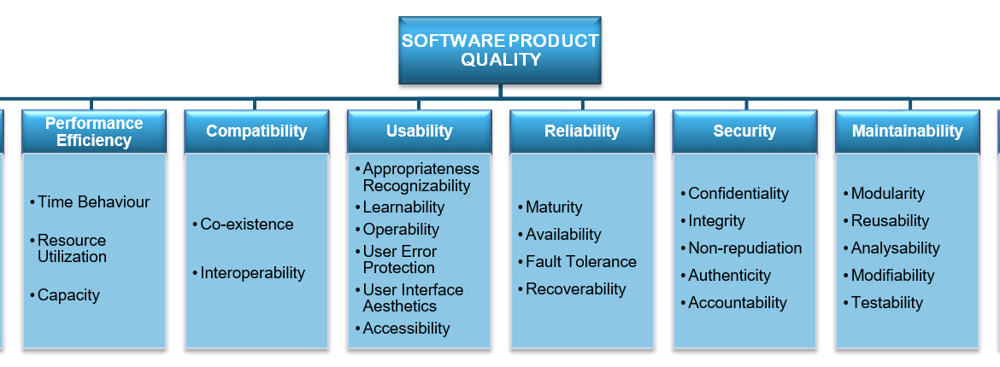

# Fase 1 – Processo de Avaliação

## **Contexto de Trabalho**

Este trabalho foi desenvolvido no âmbito da disciplina de **Qualidade de Software**, com o objetivo de proporcionar aos alunos a compreensão, do início ao fim, da execução de um processo de avaliação de um produto de software, aplicando conceitos, metodologias e normas padronizadas e reconhecidas internacionalmente. 

## **Software Escolhido**

O software escolhido para a realização do trabalho é o [**ChamaControl <sup>[1]</sup>**](#referencias-bibliograficas), criado por estudantes da disciplina de Métodos de Desenvolvimento de Software da Universidade de Brasília. Os estudantes atuaram como **responsáveis** pela implementação técnica do sistema e também como **operadores** durante a execução acadêmica, cuidando da infraestrutura e manutenção básica. 

A disponibilização do software ocorreu de forma aberta, em repositório público, o que permite classificá-los também como **fornecedores** da solução. A avaliação é conduzida por estudantes da disciplina de Qualidade de Software, sendo essa avaliação requisitada pela professora da turma. 

Os usuários finais abrangem cidadãos em geral, pesquisadores, órgãos públicos e organizações ambientais, todos interessados em acessar informações atualizadas sobre queimadas de forma simples e confiável.

| **Nome do produto** | **Versão do produto**             |
| ------------------- | --------------------------------- |
| ChamaControl        | v1.0.0 (Versão inicial acadêmica) |

#### **Domínio de Aplicação**

O sistema se insere no domínio de **monitoramento ambiental**, oferecendo uma interface web intuitiva para a consulta de dados públicos do **INPE** relacionados a focos de incêndio no Brasil. O ChamaControl organiza informações de forma estruturada e acessível, permitindo acompanhar tanto os registros anuais de queimadas quanto os focos diários mais recentes, atualizados todos os dias às 10h com base em arquivos disponibilizados pelo INPE.

#### **Classificação Técnica**

Assim, o ChamaControl foi classificado como **Software de Tempo Real** conforme [**Pressman <sup>[2]</sup>**](#referencias-bibliograficas) (2002), devido à sua função de monitoramento contínuo de incêndios e necessidade de resposta em tempo útil. 

#### **Funcionalidades do Sistema**

Além dos **dashboards interativos**, o sistema incorpora uma tela dedicada a notícias sobre queimadas, alimentada por meio da **API do GNews**, fornecendo informações complementares e contextualizadas sobre os eventos monitorados.

Para manter a base de dados atualizada, o ChamaControl conta com **três scrapers principais**:

- **processaDadosAnual**, que popula o banco de dados com registros históricos entre 2003 e 2024;
- **processaDadosDiarios30Dias**, que insere os focos registrados diariamente nos últimos 30 dias;
- **processaDadoDiario**, responsável por atualizar a aplicação diariamente com os dados mais recentes.


## Modelo de Qualidade
O modelo de qualidade utilizado nesta avaliação fundamenta-se na norma [**ISO/IEC 25010 <sup>[3]</sup>**](#referencias-bibliograficas), integrante da série SQuaRE (Systems and Software Quality Requirements and Evaluation). Esta norma foi desenvolvida para fornecer critérios claros e abrangentes na avaliação de sistemas e softwares.


<div align="center">
<p><em>Figura 1: Características do modelo de qualidade</em></p>
</div>

### Caracterísitcas de Qualidade
Para a avaliação de qualidade do software ChamaControl, foram selecionadas e priorizadas as características **Manutenibilidade** e **Eficiência de Desempenho**, com base no modelo de qualidade da norma [**ISO/IEC 25010 <sup>[3]</sup>**](#referencias-bibliograficas). A escolha dessas características foi realizada utilizando a matriz impacto x risco, permitindo uma análise quantitativa e estruturada que assegura decisões robustas, alinhadas aos objetivos do sistema e às necessidades dos stakeholders. Essa abordagem garante que os aspectos críticos do software, tanto em termos de manutenção quanto de desempenho, sejam cuidadosamente monitorados e aprimorados.


### Classificação e Ênfase das Características de Qualidade

Nesta etapa inicial do processo de avaliação, foram definidas as características de qualidade a serem analisadas com base nos objetivos do trabalho e no perfil do público-alvo do ChamaControl. 

Para apoiar a priorização das características de qualidade, foi utilizada a **Matriz Impacto x Risco**. Esse método permite classificar cada característica considerando não apenas sua importância para o sucesso do sistema (impacto), mas também a probabilidade de gerar problemas ou dificultar a evolução do software (risco). A análise garante que as escolhas não sejam subjetivas, mas fundamentadas em critérios objetivos.

A pontuação foi calculada pela soma simples entre Impacto e Risco.

``Soma = Impacto + Risco``

A seguir a tabela com as informações de Impacto e Risco atribuídas a cada característica de qualidade com seus devidos resultados.

#### Tabela Impacto x Risco

| Característica               | Impacto (1-5) | Risco (1-5) | Soma |
|------------------------------|---------------:|------------:|-----:|
| Eficiência de Desempenho     | 5              | 4           | 9    | 
| Manutenibilidade             | 5              | 4           | 9    | 
| Usabilidade                  | 3              | 3           | 6    | 
| Confiabilidade               | 2              | 2           | 4    | 
| Segurança                    | 1              | 2           | 3    | 
| Compatibilidade              | 1              | 2           | 3    | 
| Portabilidade                | 1              | 2           | 3    | 
| Funcionalidade               | 1              | 2           | 3    |
<div align="center">
<p><em>Tabela 1: Impacto x Risco Características de Qualidade com Soma Final</em></p>
</div>

#### Motivação para Definição dos Pesos

- **Eficiência de Desempenho (5 de Impacto e 4 de Risco):** 
O ChamaControl é um sistema de monitoramento que precisa atualizar e exibir dados em tempo útil, atrasos ou processamento lento comprometem a utilidade para os usuários. O risco é elevado porque os scrapers e o pipeline de dados podem se tornar gargalos, além disso a arquitetura é acadêmica e pode não estar otimizada.

- **Manutenibilidade (5 de Impacto e 4 de Risco):**
Como projeto open-source, mantido por estudantes e com potencial continuidade, a capacidade de entender, modificar e testar o código é crítica. Risco alto porque código acadêmico frequentemente falta documentação, testes e modularidade suficientes, dificultando evolução e correções rápidas.

- **Usabilidade (3 de Impacto e 3 de Risco):** 
A interface afeta diretamente a aceitação pelos usuários finais, mas não impede a funcionalidade básica (dados continuam disponíveis). Risco moderado: se a interface for confusa, usuários não aproveitarão os dados, mas isso não "quebra" o sistema.

- **Confiabilidade (2 de Impacto e 2 de Risco):**
Erros e inconsistências impactam confiança, porém o domínio (dados públicos do INPE) permite validações externas. 

- **Segurança (1 de Impacto e 2 de Risco):**
O sistema consome e exibe dados públicos, não há tratamento de dados sensíveis ou autenticação complexa explicitada.

- **Compatibilidade (1 de Impacto e 2 de Risco 2):**
A compatibilidade é desejável, mas não crítica para o propósito imediato.

- **Portabilidade (1 de Impactoe 2 de Risco 2):**
Migrar para outro ambiente não é prioridade agora, logo impacto baixo.

- **Funcionalidade (1 de Impacto e 2 de Risco 2):**
As funcionalidades essenciais já existem (scrapers, API, frontend). O foco atual é eficiência/manutenibilidade; portanto funcionalidade tem baixa prioridade relativa, com risco operacional baixo-moderado.

A partir da *[Tabela 1](#tabela-impacto-x-risco)*, com o intuito de ajustar o escopo ao semestre letivo, decidimos priorizar as características de acordo com a soma e definir intervalos de prioridades, sendo eles:

- Alta prioridade: soma >= 8
- Média prioridade: soma entre 5 e 7
- Baixa prioridade: soma <= 4

Com os intervalos, selecionamos as características que estão em "Alta Prioridade". Sendo a tabela final de priorização:


### Tabela Final de Priorização das Características
| Característica               | Soma | Prioridade        |
|-------------------------------|------|-------------------|
| Eficiência de Desempenho      | 9    | **Alta prioridade** |
| Manutenibilidade              | 9    | **Alta prioridade** |
| Usabilidade                   | 6    | Média prioridade   |
| Confiabilidade                | 4    | Baixa prioridade   |
| Segurança                     | 3    | Baixa prioridade   |
| Compatibilidade               | 3    | Baixa prioridade   |
| Portabilidade                 | 3    | Baixa prioridade   |
| Funcionalidade                | 3    | Baixa prioridade   |

<div align="center">
<p><em>Tabela 2: Definição das Características de Qualidade a serem avaliadas</em></p>
</div>

Essa priorização servirá como base para a definição das métricas e critérios de avaliação, garantindo o foco nos aspectos mais relevantes para a análise do sistema. Considerando as características priorizadas, foram elicitadas as seguintes subcaracterísticas, de acordo com o modelo de qualidade [**ISO/IEC 25010 <sup>[3]</sup>**](#referencias-bibliograficas):


<div align="center">
  
  <p><em>Figura 2: Características de qualidade escolhidas conforme priorização</em></p>
</div>

#### **Objetivo da avaliação**

A análise de qualidade do ChamaControl busca verificar se o sistema atende aos padrões definidos pelo modelo [**ISO/IEC 25010 <sup>[3]</sup>**](#referencias-bibliograficas), considerando atributos de Eficiência de Desempenho e Manutenibilidade. Entre os objetivos específicos destacam-se:

- Avaliar se o sistema utiliza os recursos computacionais de forma adequada e se responde dentro de prazos aceitáveis, considerando seu propósito de monitoramento ambiental;

- Identificar melhorias que possam otimizar o tempo de resposta, a utilização de recursos e a capacidade do sistema;

- Examinar o grau de modularidade, testabilidade e modificabilidade do software, verificando se sua estrutura favorece manutenção e evolução;

Portanto, ao final do processo de avaliação, procura-se produzir diagnóstico técnico direcionado a essas duas características e relatórios de comparações com sistemas de propósito semelhante, que servirão como base para ajustes futuros e possível continuação do software.

## Escopo, Profundidade e Objetos de Avaliação

### Escopo
A avaliação abrangerá os **principais módulos** do sistema **ChamaControl**, a saber:

- **Coleta de dados**: Scrapers responsáveis pela importação e atualização de dados do INPE (.csv) e do GNews (notícias).  
- **Armazenamento**: Estrutura de persistência em banco de dados MySQL.  
- **API Backend**: Endpoints em Node.js/Express responsáveis por fornecer dados processados.  
- **Front-end**: Interface desenvolvida em React/Vite, incluindo componentes, rotas e visualizações gráficas.  

Abaixo são mencionados quais módulos do sistema estão **Fora do escopo** e portanto, não serão avaliados nesta fase:

- Configurações de infraestrutura (Docker e docker-compose).  
- Ferramentas externas de teste/documentação (Postman, Swagger).  

### Profundidade
O nível de análise será **intermediário**, contemplando:  

- Verificação de corretude das principais funcionalidades (coleta, armazenamento, exibição e consumo de API).  
- Testes funcionais de cenários típicos (visualização de gráficos, acesso às notícias, chamadas básicas à API).  
- Checagem de consistência entre dados coletados e exibidos.  
  
**Não serão realizados**:  

- Testes extensivos de performance.  
- Testes de segurança avançada.  
- Análises profundas de logs de execução.  

### Objetos de Avaliação
**Funcionalidades específicas**:  

- Execução diária do scraper.  
- Consulta de dados históricos e recentes via API.  
- Renderização de gráficos de focos de incêndio no front-end.  
- Exibição de notícias atualizadas sobre queimadas.  

**Fluxos principais de usuário**: 
 
- Acesso à interface web (navegação entre páginas).  
- Consulta e interpretação de dados apresentados em gráficos.  
- Visualização de notícias integradas ao sistema.  

## ODS Relacionados e Metas Associadas

A avaliação do **ChamaControl** também se conecta a objetivos mais amplos, especialmente aos [**Objetivos de Desenvolvimento Sustentável (ODS) da ONU <sup>[4]</sup>**](#referencias-bibliograficas) , reforçando a relevância social e ambiental do sistema.

<div style="display: flex; flex-wrap: wrap; justify-content: center; gap: 20px; max-width: 800px; margin: auto;">
  <!-- Linha 1: 3 imagens -->
  <div style="flex: 0 0 30%; text-align: center;">
    <a href="https://brasil.un.org/pt-br/sdgs/3" target="_blank">
      
    </a>
  </div>
  <div style="flex: 0 0 30%; text-align: center;">
    <a href="https://brasil.un.org/pt-br/sdgs/9" target="_blank">
      
    </a>
  </div>
  <div style="flex: 0 0 30%; text-align: center;">
    <a href="https://brasil.un.org/pt-br/sdgs/11" target="_blank">
      
    </a>
  </div>

  <!-- Linha 2: 2 imagens -->
  <div style="flex: 0 0 30%; text-align: center;">
    <a href="https://brasil.un.org/pt-br/sdgs/13" target="_blank">
      
    </a>
  </div>
  <div style="flex: 0 0 30%; text-align: center;">
    <a href="https://brasil.un.org/pt-br/sdgs/15" target="_blank">
      
    </a>
  </div>
</div>


### Principal
- [**ODS 13 - Ação contra a mudança global do clima <sup>[5]</sup>**](#referencias-bibliograficas)

**Meta 13.1:** Reforçar a resiliência e a capacidade de adaptação a riscos relacionados ao clima e desastres naturais.  
**Indicador:** Frequência de atualização dos focos de incêndio por estado/região (diária, às 10h).  
**Pertinência:** O ChamaControl fornece dados atualizados diariamente, permitindo respostas rápidas a novos incêndios e fortalecendo a adaptação a eventos climáticos, mesmo no nível estadual.

**Meta 13.3:** Melhorar a conscientização e a capacidade institucional sobre mitigação e adaptação.  
**Indicador:** Número de acessos ao painel e notícias relacionadas a incêndios.  
**Pertinência:** Ao disponibilizar dashboards interativos e notícias atuais integradas, o software amplia a conscientização da população e de órgãos públicos sobre os impactos ambientais dos incêndios.

- [**ODS 15 - Vida Terrestre <sup>[6]</sup>**](#referencias-bibliograficas)

**Meta 15.1:** Assegurar a conservação e uso sustentável de ecossistemas terrestres.  
**Indicador:** Áreas impactadas monitoradas por estado/região (dados INPE).  
**Pertinência:** O sistema organiza informações históricas (2003–2024) e diárias, permitindo avaliar danos ambientais e subsidiar políticas de preservação da biodiversidade em nível regional.

**Meta 15.5:** Reduzir a degradação de habitats naturais e perda de biodiversidade.  
**Indicador:** Número de focos detectados em regiões com proteção ambiental.  
**Pertinência:** O monitoramento estadual permite identificar incêndios em ecossistemas sensíveis, podendo fornecer dados úteis para ações de proteção ambiental.


### Secundária
- [**ODS 3 – Saúde e Bem-estar <sup>[7]</sup>**](#referencias-bibliograficas)

**Meta 3.9:** Reduzir mortes e doenças causadas pela poluição do ar.  
**Indicador:** Quantidade de focos em regiões urbanas e notícias sobre impactos à saúde.  
**Pertinência:** O software evidencia a relação entre queimadas e risco à saúde em escala estadual, apoiando políticas de prevenção e conscientização.

- [**ODS 9 – Indústria, Inovação e Infraestrutura <sup>[8]</sup>**](#referencias-bibliograficas)

**Meta 9.5:** Melhorar a capacidade tecnológica de setores relevantes.  
**Indicador:** Volume de dados processados pelos scrapers e funcionalidades implementadas.  
**Pertinência:** O ChamaControl aplica inovação tecnológica ao coletar, organizar e exibir dados ambientais em tempo real, fortalecendo a infraestrutura digital para análise e tomada de decisão.


- [**ODS 11 – Cidades e Comunidades Sustentáveis <sup>[9]</sup>**](#referencias-bibliograficas)

**Meta 11.5:** Reduzir perdas humanas e econômicas por desastres relacionados ao clima.  
**Indicador:** Número de focos de incêndio próximos a regiões urbanas por estado.  
**Pertinência:** Ao mapear incêndios próximos a áreas urbanas em nível estadual, o sistema ajuda gestores públicos a planejar ações preventivas, mesmo sem detalhamento municipal.

## Conclusão

A Fase 1 permitiu estruturar de forma clara o processo de avaliação do ChamaControl, definindo o contexto, objetivos, escopo, métricas e alinhamento com os ODS da ONU.  
Esse trabalho inicial fornece a base para análises mais aprofundadas nas próximas etapas, garantindo que o sistema seja avaliado de maneira sistemática e orientada a melhorias contínuas.

```Declaração de Uso da IA: Durante a elaboração deste documento foram utilizadas ferramentas de inteligência artificial baseadas em modelos de linguagem como apoio para: ```<br>
`(1) sugerir uma organização coerente dos tópicos;`<br>
`(2) revisar ortografia e gramática;`<br>
`(3) verificar a cobertura dos critérios do documento de avaliação.`<br>
 
 Todas as sugestões foram revisadas e, quando apropriado, editadas manualmente pela(s) pessoa(s) responsável(is) pelo trabalho.

## Referências Bibliográficas

> [1] ChamaControl. Disponível em: <https://github.com/unb-mds/2024-2-ChamaControl>. Acesso em: 29 de setembro de 2025 

> [2] PRESSMAN, Roger S. Engenharia de Software: Uma Abordagem Profissional. 6. ed. São Paulo: McGraw-Hill, 2002. Disponível em: <https://archive.org/details/pressman-engenharia-de-software-uma-abordagem-profissional-8a/mode/2up>. Acesso em:  29 de setembro de 2025. 

> [3] ISO/IEC 25010:2011. Systems and software engineering — Systems and software Quality Requirements and Evaluation (SQuaRE) — System and software quality models. Geneva: ISO, 2011. Disponível em: <https://iso25000.com/index.php/en/iso-25000-standards/iso-25010>. Acesso em: 29 de setembro de 2025.

> [4] ORGANIZAÇÃO DAS NAÇÕES UNIDAS. Objetivos de Desenvolvimento Sustentável. As Nações Unidas no Brasil, 2025. Disponível em: <https://brasil.un.org/pt-br/sdgs>. Acesso em: 29 de setembro de 2025.

> [5] ORGANIZAÇÃO DAS NAÇÕES UNIDAS. Objetivo de Desenvolvimento Sustentável 13: Ação contra a mudança global do clima. Disponível em: <https://brasil.un.org/pt-br/sdgs/13>. Acesso em: 29 set. 2025.

> [6] ORGANIZAÇÃO DAS NAÇÕES UNIDAS. Objetivo de Desenvolvimento Sustentável 15: Vida terrestre. Disponível em: <https://brasil.un.org/pt-br/sdgs/15>. Acesso em: 29 set. 2025.

> [7] ORGANIZAÇÃO DAS NAÇÕES UNIDAS. Objetivo de Desenvolvimento Sustentável 3: Saúde e Bem-Estar. Disponível em: <https://brasil.un.org/pt-br/sdgs/3>. Acesso em: 29 set. 2025.

> [8] ORGANIZAÇÃO DAS NAÇÕES UNIDAS. Objetivo de Desenvolvimento Sustentável 9: Indústria, Inovação e Infraestrutura. Disponível em: <https://brasil.un.org/pt-br/sdgs/9>. Acesso em: 29 set. 2025.

> [9] ORGANIZAÇÃO DAS NAÇÕES UNIDAS. Objetivo de Desenvolvimento Sustentável 11: Cidades e Comunidades Sustentáveis. Disponível em: <https://brasil.un.org/pt-br/sdgs/11>. Acesso em: 29 set. 2025.

> INTERNATIONAL ORGANIZATION FOR STANDARDIZATION. ISO/IEC 25010:2023 – Systems and software engineering – Systems and software Quality Requirements and Evaluation (SQuaRE) – System and software quality models. Disponível em: <https://iso25000.com/index.php/en/iso-25000-standards/iso-25010>. Acesso em: 29 set. 2025.


## Contribuição dos Integrantes

| Integrante                                | Matrícula | Percentual |
| ----------------------------------------- | --------- | ---------- |
| **Breno Soares Fernandes**                | 202017540 | 16,6%      |
| **Bruno Ricardo de Menezes**              | 221007680 | 16,6%      |
| **Enrico Martins Mantoan Zoratto**        | 222006688 | 16,6%      |
| **Filipe Bressanelli Azevedo Filho**      | 222024579 | 16,6%      |
| **Gabriel Soares dos Anjos**              | 231026625 | 16,6%      |
| **Leonardo Henrique Sobral Sauma Junior** | 231035428 | 16,6%      |

## Histórico de versão

| Versão | Data       | Descrição                                                                                                                                                                                     | Autores                                                                                                                                                                                                                                                                                 |
| ------ | ---------- | --------------------------------------------------------------------------------------------------------------------------------------------------------------------------------------------- | --------------------------------------------------------------------------------------------------------------------------------------------------------------------------------------------------------------------------------------------------------------------------------------- |
| 1.0    | 29/09/2025 | Criação da página inicial, inclusão de contexto e software, definição de escopo e profundidade, métricas, priorização das características de qualidade, revisão final, conclusão e formatação | [Breno Soares](https://github.com/Brenofrds), [Bruno Ricardo](https://github.com/EhOBruno), [Enrico Zoratto](https://github.com/sidts), [Filipe Azevedo](https://github.com/fbressa), [Gabriel dos Anjos](https://github.com/SAnjos3), [Leonardo Sauma Jr](https://github.com/leohssjr) |
| 1.1    | 01/10/2025 | Ajustes, adição da representação visual das características escolhidas                                                                                                                        | [Filipe Azevedo](https://github.com/fbressa)                                                                                                                                                                                                                                            |
| 1.2    | 01/10/2025 | Adição do tópico "Uso de IA" e reajuste do código md para melhorias na visualização e organização dos tópicosv                                                                                | [Gabriel Soares](https://github.com/SAnjos3) |
| 1.3    | 01/10/2025 | Adicionando priorização Impacto x Risco| [Leonardo Sauma](https://github.com/leohssjr) |
| 1.4    | 01/10/2025 | Ajustando ODS, adicionando meta/indicadores e persistência no software | [Leonardo Sauma](https://github.com/leohssjr) |
