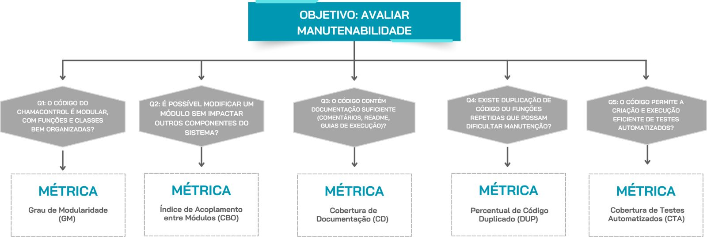
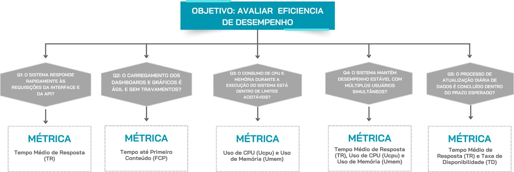

# Fase 2 - Especificação

## Aplicação da Metodologia GQM

A metodologia **GQM (Goal-Question-Metric)** tem como propósito estabelecer uma relação direta entre os **objetivos da avaliação de qualidade** e as **métricas utilizadas para mensurá-los**. O método propõe uma estrutura em três níveis hierárquicos:

- **Goal (Objetivo):** Define o propósito da medição, o objeto a ser analisado, o ponto de vista e o contexto.

- **Question (Questões):** Traduzem o objetivo em perguntas específicas que ajudam a compreender se ele está sendo atingido.

- **Metric (Métricas):** São os indicadores quantitativos e qualitativos usados para responder às perguntas formuladas.

Essa abordagem garante que a medição da qualidade seja **focada, rastreável e alinhada aos objetivos do projeto**, evitando métricas arbitrárias e promovendo uma análise consistente e objetiva.

## Aplicação do GQM ao ChamaControl

Com base na [Fase 1 - Processo de Avaliação](../Fase%201/index.md), foram priorizadas as características de qualidade Manutenibilidade e Eficiência de Desempenho, conforme a ISO/IEC 25010.
A seguir, são detalhados os objetivos, perguntas e métricas definidos para cada uma delas.

## Objetivo da Medição 1: Manutenibilidade

<table border="1">
  <tr>
    <td>Analisar</td>
    <td>o ChamaControl</td>
  </tr>
  <tr>
    <td>Para o propósito de</td>
    <td>avaliar a facilidade de manutenção e evolução do código</td>
  </tr>
  <tr>
    <td>Com respeito a</td>
    <td>manutenabilidade</td>
  </tr>
  <tr>
    <td>Do ponto de vista da</td>
    <td>equipe de desenvolvimento</td>
  </tr>
  <tr>
    <td>No contexto da</td>
    <td>disciplina de Qualidade de Software</td>
  </tr>
</table>

---

### Questões de Manutenabilidade

**Q1:** O código do ChamaControl é modular?  
**Subcaracterística:** *Modularidade*  
**Hipótese 1:** Mais de 80% das funções estão agrupadas de forma coerente e com responsabilidade clara, facilitando modificações.  
**Métricas utilizadas:** *Grau de Modularidade (GM)*

**Q2:** É possível modificar um módulo sem impactar outros componentes do sistema?  
**Subcaracterística:** *Modificabilidade*  
**Hipótese 2:** Alterações em módulos independentes afetam menos de 10% de outros módulos, indicando baixo acoplamento.  
**Métricas utilizadas:** *Índice de Acoplamento entre Módulos (CBO)*

**Q3:** O código contém documentação suficiente?  
**Subcaracterística:** *Analisabilidade*  
**Hipótese 3:** A maioria das funções possuem comentários e instruções de manutenção.  
**Métricas utilizadas:** *Cobertura de Documentação (CD)*

**Q4:** Existe duplicação de código ou funções repetidas que possam dificultar manutenção?  
**Subcaracterística:** *Reutilização*  
**Hipótese 4:** Menos de 10% do código é duplicado, permitindo maior facilidade de manutenção e evolução.  
**Métricas utilizadas:** *Percentual de Código Duplicado (DUP)*

**Q5:** O código permite a criação e execução eficiente de testes automatizados?  
**Subcaracterística:** *Testabilidade*  
**Hipótese 5:** As funções principais possuem cobertura de teste automatizado superior a 80%.  
**Métricas utilizadas:** *Cobertura de Testes Automatizados (CTA)* 

**Q6:** O nível de complexidade do código impacta a facilidade de manutenção e evolução do sistema?

**Subcaracterística:** Analisabilidade

**Hipótese 6:** As funções apresentam complexidade ciclomática média inferior a 10, indicando que o código é de fácil compreensão e exige menor esforço para manutenção.

**Métricas utilizadas:** Complexidade Ciclomática Média (CCM)

---

### Métricas de Manutenibilidade

#### Grau de Modularidade (GM)

**Objetivo:**  
Verificar se o sistema possui módulos bem definidos e organizados, com responsabilidades claras.

**Fórmula:**  
Percentual de módulos com *Maintainability Rating* “A” ou “B” no SonarQube.

**Coleta:**  
Verificar no **SonarQube** os indicadores:  
- *Maintainability Rating (A–E)*  
- *Code Smells* de baixa coesão  
- *Technical Debt Ratio*

**Interpretação:**  
- ≥ 80% → boa modularidade  
- 60–79% → aceitável  
- < 60% → modularidade fraca, possível acoplamento

---

#### Índice de Acoplamento entre Módulos (CBO)

**Objetivo:**  
Avaliar o grau de dependência entre classes e módulos, medindo o impacto de alterações no sistema.

**Fórmula:**  
Valor médio do *Coupling Between Objects (CBO)* reportado pelo SonarQube.

**Coleta:**  
Usar o **SonarQube** para identificar:  
- *CBO* por classe  
- *Code Smells* de “Excessive coupling”  
- *Complexity by file*

**Interpretação:**  
- ≤ 10 → baixo acoplamento  
- 11–25 → moderado  
- > 25 → alto, difícil de manter

---

#### Cobertura de Documentação (CD)

**Objetivo:**  
Verificar se o código está bem documentado, com proporção adequada de comentários, README e guias de manutenção.

**Fórmula:**  
CD = Nível de documentação atribuído na escala de 1 a 5

**Coleta:**  
Realizar uma avaliação qualitativa do projeto, considerando:  
- Presença e qualidade dos **comentários no código**;  
- Existência e clareza do **README**;  
- Disponibilidade de **guias de instalação ou execução**.  

**Um bom comentário é aquele que:**

- Explica o **motivo** da escolha, não o óbvio.  
- Está **atualizado** e **coerente** com o código.  
- Segue **padrões consistentes** e contribui para a **manutenibilidade**.  

**Interpretação / Observações:**  
1 - Documentação muito baixa: quase inexistente; ausência de comentários e guias.  
2 - Documentação insuficiente: poucos comentários e README incompleto.  
3 - Documentação mediana: explicações básicas e estrutura parcialmente clara.  
4 - Documentação boa: código comentado e instruções compreensíveis.  
5 - Documentação completa: comentários consistentes, README detalhado e guias claros.

---

#### Percentual de Código Duplicado (DUP)

**Objetivo:**  
Avaliar a taxa de duplicação de código, que reduz a reutilização e aumenta o esforço de manutenção.

**Fórmula:**  
Valor de **Duplicated Lines (%)** reportado pelo SonarQube.

**Coleta:**  
Consultar no **SonarQube** a métrica *Duplicated Lines (%)*.

**Interpretação:**  
- < 10% → ótima reutilização  
- 10–20% → aceitável  
- > 20% → exige refatoração

---

#### Cobertura de Testes Automatizados (CTA)

**Objetivo:**  
Avaliar a extensão dos testes automatizados sobre o código do sistema, medindo o quanto das funções e módulos principais estão cobertos por testes de unidade ou integração.

**Fórmula:**  
CTA = Percentual de **Linhas cobertas (% Lines)** reportado pelo Jest no relatório de cobertura.

**Método de Coleta:**  
Ferramenta de análise de cobertura de testes **Jest**, para gerar relatórios automáticos.  

**Interpretação / Observações:**
- ≥ 80% → excelente cobertura
- 60–79% → aceitável
- < 60% → baixa testabilidade

#### Complexidade Ciclomática Média (CCM)

**Objetivo:**   
Avaliar o nível de complexidade lógica das funções e métodos do sistema, medindo o esforço necessário para compreender, testar e manter o código.

**Fórmula:**   

Complexidade por função (McCabe):
\[
CC = E - N + 2P
\]

Onde:  
- *E* = número de arestas (fluxos de controle entre blocos de código)  
- *N* = número de nós (blocos de código ou instruções)  
- *P* = número de componentes conectados (geralmente 1 por função)

Simplificação prática:
\[
CC = \text{Número de estruturas de decisão} + 1
\]

Complexidade Ciclomática Média do sistema:
\[
CCM = \frac{\sum_{i=1}^{n} CC_i}{n}
\]

Onde:  
- *CCM* = Complexidade Ciclomática Média do sistema  
- *CC_i* = Complexidade Ciclomática da função i  
- *n* = número total de funções ou métodos analisados

**Método de Coleta:** 
Verificar no SonarQube os seguintes indicadores:  
- Cyclomatic Complexity por função, classe ou arquivo  
- Cognitive Complexity (para análise complementar de legibilidade)  
- Code Smells relacionados a estruturas de decisão excessivas (if, switch, for, while aninhados)

**Interpretação / Observações:**  
- *≤ 10* → Boa manutenibilidade: código simples, fácil de entender e testar  
- *11–20* → Complexidade moderada: manutenção possível, mas requer atenção em revisões  
- *> 20* → Alta complexidade: difícil de entender e testar, recomenda-se refatoração

Oservações:  
- Valores altos de CCM indicam funções com muitos caminhos de execução, dificultando a testabilidade e aumentando o risco de falhas  
- Recomenda-se refatorar métodos com CCM acima de 15, dividindo-os em funções menores e mais coesas  
- Essa métrica está diretamente relacionada às subcaracterísticas *Analisabilidade* e *Modificabilidade, ambas da **Manutenibilidade*
---

### Diagrama Manutenibilidade

<em>Figura 1: Estrutura de avaliação da manutenibilidade com base em questões e métricas.</em>

## Objetivo da Medição 2: Eficiência de Desempenho

<table border="1">
  <tr>
    <td>Analisar</td>
    <td>o ChamaControl</td>
  </tr>
  <tr>
    <td>Para o propósito de</td>
    <td>avaliar o desempenho e tempo de resposta</td>
  </tr>
  <tr>
    <td>Com respeito a</td>
    <td>eficiência de desempenho</td>
  </tr>
  <tr>
    <td>Do ponto de vista da</td>
    <td>equipe de desenvolvimento e usuários finais</td>
  </tr>
  <tr>
    <td>No contexto da</td>
    <td>disciplina de Qualidade de Software</td>
  </tr>
</table>

---

### Questões de Eficiência de Desempenho

**Q1:** O sistema responde rapidamente?  
**Hipótese 1:** O tempo médio de resposta das APIs e das páginas é inferior a **2 segundos** em mais de **90% das consultas**.  
**Métricas utilizadas:** *Tempo Médio de Resposta (TR)*  

---

**Q2:** O carregamento é ágil e sem travamentos?  
**Hipótese 2:** Mais de **95%** dos gráficos e dashboards carregam completamente em menos de **3 segundos**.  
**Métricas utilizadas:** *Tempo até Primeiro Conteúdo (FCP)*

---

**Q3:** O sistema consome muita memória e CPU?  
**Hipótese 3:** O uso de CPU não ultrapassa **70%** e a memória utilizada não ultrapassa **80%** da capacidade disponível durante operações críticas.  
**Métricas utilizadas:** *Uso de CPU (Ucpu)* e *Uso de Memória (Umem)*

---

**Q4:** O sistema mantém desempenho estável com múltiplos usuários simultâneos?  
**Hipótese 4:** Até **50 usuários simultâneos** não causam degradação significativa no tempo de resposta ou erros de execução.  
**Métricas utilizadas:** *Tempo Médio de Resposta (TR)*, *Uso de CPU (Ucpu)* e *Uso de Memória (Umem)*

---

**Q5:** O processo de atualização diária de dados é concluído dentro do prazo esperado?  
**Hipótese 5:** Os *scrapers* e pipelines processam os dados diários em menos de **30 minutos** em **95% das execuções**.  
**Métricas utilizadas:** *Tempo Médio de Resposta (TR)* e *Taxa de Disponibilidade (TD)*

---

**Q6:** As consultas ao banco de dados e o processamento das informações sobre queimadas estão otimizados?  
**Métricas utilizadas:** *Tempo até Primeiro Conteúdo (FCP)* e *Uso de CPU (Ucpu)*

---

### Métricas de Eficiência de Desempenho

#### Tempo Médio de Resposta (TR)

- **Objetivo:**  
Avaliar a velocidade média de resposta das requisições da API e da interface web.  

- **Fórmula:**  
TR = (Σ Tempo de Resposta das Requisições) / Número Total de Requisições

- **Método de Coleta:**  
Medições realizadas com o **DevTools** ou **Lighthouse**, simulando cenários de uso típicos do sistema.  

- **Interpretação / Observações:**  
Valores até **2 segundos** indicam desempenho ideal. Respostas mais lentas sugerem **gargalos nas rotas da API**, **consultas SQL complexas** ou **ausência de cache**. 

#### Tempo até Primeiro Conteúdo (FCP)

- **Objetivo:**  
Avaliar a rapidez com que o usuário visualiza o primeiro elemento do dashboard (gráfico, texto ou título), refletindo a percepção de desempenho do sistema.  

- **Método de Coleta:**  
Medições via **Lighthouse** ou **Chrome DevTools**, na aba *Performance*, registrando o tempo até o primeiro conteúdo visível na tela.  

- **Interpretação / Observações:**  
Valores até **3 segundos** indicam carregamento fluido e experiência satisfatória. Tempos superiores sugerem renderização ineficiente, scripts pesados ou sobrecarga no front-end.  

#### Uso de CPU (Ucpu)

- **Objetivo:**  
Avaliar a carga média de processamento utilizada durante a execução do sistema, identificando possíveis gargalos.

- **Fórmula:**  
Ucpu = (Tempo de CPU usado / Tempo total de execução) × 100

- **Método de Coleta:**  
Monitoramento durante a execução de cenários reais, utilizando ferramentas como htop, Task Manager, Lighthouse ou logs do servidor.

- **Interpretação / Observações:**  
Valores sustentados acima de 70% indicam sobrecarga e necessidade de otimização de código, consultas SQL ou algoritmos.

#### Uso de Memória (Umem)

- **Objetivo:**  
Mensurar a eficiência no uso da memória do sistema durante a execução, prevenindo travamentos e lentidão.

- **Fórmula:**  
Umem = (Memória usada / Memória total disponível) × 100

- **Método de Coleta:**  
Monitoramento via navegador, servidor ou ferramentas como htop, Chrome DevTools e Monitor do Sistema.

- **Interpretação / Observações:**  
Picos acima de 80% indicam risco de instabilidade. Ideal manter consumo regular abaixo desse limite para garantir fluidez e estabilidade.

#### Taxa de Disponibilidade (TD)

- **Objetivo:**  
Avaliar a estabilidade e a disponibilidade do sistema no tempo, garantindo operação contínua e confiável.

- **Fórmula:**  
TD = (Tempo disponível / Tempo total) × 100

- **Método de Coleta:**  
Logs de implantação e monitoramento da hospedagem (por exemplo, uptime monitor).

- **Interpretação / Observações:**  
Meta recomendada ≥ 99% de uptime. Quedas recorrentes reduzem a eficiência percebida e indicam falhas de infraestrutura.

### Diagrama Eficiência de Desempenho

<em>Figura 2: Estrutura de avaliação da eficiência de desempenho com base em questões e métricas.</em>

## Referências Bibliográficas
> LC00-GQM-Introducao. Disponível em: <https://aprender3.unb.br/pluginfile.php/3230283/mod_folder/content/0/LC00-GQM-Introducao.pdf?forcedownload=1>. Acesso em: 14 de outubro de 2025.

> LC01-GQM-Planejamento. Disponível em: <https://aprender3.unb.br/pluginfile.php/3230283/mod_folder/content/0/LC01-GQM-Planejamento.pdf?forcedownload=1>. Acesso em: 14 de outubro de 2025.

> LC02-GQM-Definicao. Disponível em: <https://aprender3.unb.br/pluginfile.php/3230283/mod_folder/content/0/LC02-GQM-Definicao.pdf?forcedownload=1>. Acesso em: 14 de outubro de 2025.

> LC03-GQM-Coleta. Disponível em: <https://aprender3.unb.br/pluginfile.php/3230283/mod_folder/content/0/LC03-GQM-Coleta.pdf?forcedownload=1>. Acesso em: 14 de outubro de 2025.

> LC04-GQM-Interpretacao. Disponível em: <https://aprender3.unb.br/pluginfile.php/3230283/mod_folder/content/0/LC04-GQM-Interpretacao.pdf?forcedownload=1>. Acesso em: 14 de outubro de 2025.

> LC05-GQM-Exemplo. Disponível em: <https://aprender3.unb.br/pluginfile.php/3230283/mod_folder/content/0/LC05-GQM-Exemplo.pdf?forcedownload=1>. Acesso em: 14 de outubro de 2025.

## Histórico de versão

|Versão|Data|Descrição|Autor(es)|Revisor(es)|
|-|-|-|-|-|
|1.0 | 14/10/2025 | Criação do documento base|[Leonardo Sauma](https://github.com/leohssjr)||
|1.1 | 14/10/2025 | Adição de objetivos e questões sobre as caracterísitcas Manutenabilidade e Eficiência de Desempenho|[Leonardo Sauma](https://github.com/leohssjr)||
|1.2 | 14/10/2025 | Inclusão das métricas detalhadas de Eficiência de Desempenho (TR, FCP, Ucpu, Umem, TD) e revisão da estrutura GQM|[Breno Fernandes](https://github.com/BrenoFrds)||
|1.3 | 15/10/2025 | Adição de diagramas para visualização das medições|[Filipe Bressanelli](https://github.com/fbressa)||