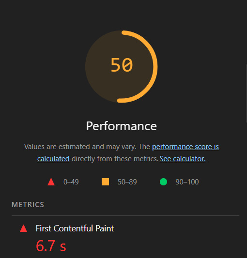

# M10 — Tempo até Primeiro Conteúdo (FCP)

## Objetivo da Métrica

Avaliar a rapidez com que o usuário visualiza o **primeiro elemento renderizado na interface do sistema ChamaControl** (texto, título, gráfico ou outro componente visual), refletindo diretamente a **percepção inicial de desempenho da aplicação**.

Essa métrica está vinculada à subcaracterística **Comportamento em Relação ao Tempo**, pertencente à característica de qualidade **Eficiência de Desempenho** (ISO/IEC 25010).

O **First Contentful Paint (FCP)** mede o tempo decorrido desde o início do carregamento até a renderização do **primeiro conteúdo visível na tela**, sendo um dos principais indicadores de desempenho percebido pelo usuário.

---

## Condições de Coleta

Para garantir reprodutibilidade e confiabilidade da medição, o experimento foi conduzido sob condições controladas, conforme descrito abaixo:

* **Dispositivo utilizado:** Computador pessoal (desktop)
* **Sistema operacional:** Windows 11 Pro (64 bits)
* **Tipo de conexão:** Wi-Fi
* **Velocidade da internet:** 70 Mb/s (download) / 70 Mb/s (upload)
* **Roteador / Provedor:** Conexão residencial estável
* **Navegador utilizado:** Google Chrome (versão estável mais recente no momento do teste)
* **Ferramenta utilizada:** Lighthouse (executado localmente via GitHub do projeto)
* **Caches:** Cache do navegador limpo antes da execução
* **Situação do sistema:**

  * Nenhuma aba adicional aberta
  * Baixa utilização de CPU e memória
  * Sem processos pesados em segundo plano

Essas condições asseguram que o valor obtido represente fielmente o desempenho do front-end da aplicação, minimizando interferências externas.

---

## Método de Coleta

A coleta foi realizada por meio da ferramenta **Lighthouse**, disponível no **Chrome DevTools**, seguindo os seguintes passos:

1. Acesso ao sistema ChamaControl via navegador.
2. Abertura do **Chrome DevTools**.
3. Execução do **Lighthouse** na aba **Performance**.
4. Registro do valor da métrica **First Contentful Paint (FCP)**.
5. Captura da evidência visual do relatório gerado.

A métrica representa o **tempo até a renderização do primeiro conteúdo visível ao usuário**.

---

## Resultado Obtido

De acordo com o relatório gerado pelo Lighthouse:

* **First Contentful Paint (FCP): 6,7 segundos**

---

## Critério de Julgamento

Conforme definido na Fase 2 do projeto:

* **≤ 3 s → Ótimo**
* **> 3 s → Carregamento lento**

Classificação obtida: **Carregamento lento**

---

## Evidência da Coleta (Imagem)

## Interpretação dos Resultados

O valor obtido para o FCP foi de **6,7 segundos**, estando **acima do limite recomendado de 3 segundos**, o que indica:

* Lentidão perceptível no carregamento inicial da interface
* Primeira renderização tardia do conteúdo visível
* Impacto negativo direto na experiência do usuário
* Indícios de gargalos no carregamento do front-end

Entre as possíveis causas técnicas destacam-se:

* Scripts JavaScript pesados ou bloqueantes
* Imagens não otimizadas
* Bloqueio de renderização por arquivos CSS
* Ausência de carregamento assíncrono
* Falta de técnicas de **preload**, **lazy loading** ou **code splitting**

Dessa forma, **o desempenho inicial do sistema é considerado insatisfatório segundo a métrica FCP**.

---

## Conclusão

A métrica **Tempo até Primeiro Conteúdo (FCP)** apresentou desempenho **abaixo do esperado**.
Com valor de **6,7 segundos**, o sistema **não atende ao padrão ideal de carregamento inicial**, evidenciando a necessidade de intervenções no front-end.

Recomenda-se a adoção das seguintes melhorias:

* Otimização de imagens e recursos estáticos
* Redução de scripts bloqueantes
* Uso de carregamento assíncrono
* Implementação de **lazy loading**
* Otimização do carregamento do conteúdo crítico da página

Portanto, **a hipótese de carregamento inicial rápido não foi confirmada**.

---

## Histórico de versão

| Versão | Data       | Descrição                                           | Autor(es)                                  | Revisor(es) |
| ------ | ---------- | --------------------------------------------------- | ------------------------------------------ | ----------- |
| 1.0    | 26/11/2025 | Criação do documento da métrica FCP                 | [Enrico Zoratto](https://github.com/sidts) |             |
| 1.1    | 27/11/2025 | Adição de informações importantes e print da medição | [Filipe Bressanelli](https://github.com/fbressa) |             |

