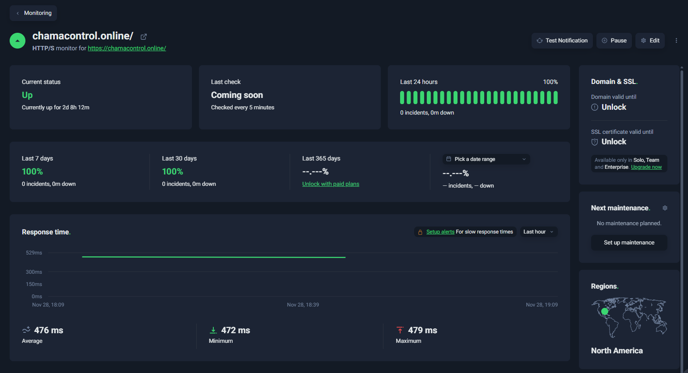

# Taxa de Disponibilidade (TD)

## Objetivo da Métrica
Avaliar a estabilidade e a continuidade de operação do sistema ChamaControl, identificando se o serviço permanece acessível ao longo do tempo.

Esta métrica está associada à subcaracterística **Disponibilidade**, pertencente à característica de qualidade **Eficiência de Desempenho** no modelo ISO/IEC 25010.

---

## Condições de Coleta

Para garantir a confiabilidade da medição, o monitoramento foi realizado utilizando ferramentas automatizadas sob as seguintes condições:

- **Ferramenta:** UptimeRobot (Versão Gratuita)
- **Tipo de Monitoramento:** HTTP(s)
- **URL Monitorada:** `https://chamacontrol.online/`
- **Intervalo de Checagem:** 5 minutos
- **Período Observado:** ~ 2 dias e meio (mínimo de 24h)
- **Ambiente:** Servidor de produção atual do ChamaControl

---

## Método de Coleta
A coleta foi realizada através da configuração de um monitor externo que verifica periodicamente o status de resposta do servidor.

**Procedimento executado:**

1. Configurar um monitor do tipo **HTTP(s)** na plataforma UptimeRobot.
2. Inserir a URL pública da aplicação (`https://chamacontrol.online/`).
3. Definir o intervalo de *ping* para 5 minutos.
4. Aguardar o período de monitoramento para a coleta de dados (mínimo de 24 horas).
5. Registrar os dados de percentual de disponibilidade, incidentes e tempo online.
6. Capturar a evidência visual (print) do painel de resumo.

---

## Resultado Obtido

Durante o período monitorado, os dados registrados pelo UptimeRobot foram:

| Indicador | Valor |
|-----------|-------|
| Disponibilidade (24h) | **100%** |
| Incidentes Registrados | 0 |
| Tempo Total Online | 2 dias, 8 horas |
| Status Atual | **Up** (Sem interrupções) |

### Observações
- A disponibilidade atingiu o valor máximo possível (100%).
- Não houve registro de *downtime* (tempo de inatividade) ou micro-quedas durante a janela de observação.
- O servidor demonstrou estabilidade contínua por mais de 48 horas.

---

## Interpretação dos Resultados

De acordo com os critérios definidos na Fase 3:

> *Taxas de disponibilidade ≥ 99% são consideradas excelentes; valores abaixo de 99% requerem análise de infraestrutura.*

Como o resultado obtido foi de **100%**, a aplicação apresenta:

- **Alto nível de eficiência e desempenho** na infraestrutura de hospedagem.
- **Estabilidade total** durante o período de teste.
- Ausência de interrupções perceptíveis aos usuários finais.

---

## Ligação entre a Questão e a Hipótese

### Questão GQM Q7 (Eficiência de Desempenho)
"**O sistema permanece disponível durante o uso normal?**"

### Hipótese 7
"**O sistema mantém taxa de disponibilidade igual ou superior a 99% no período avaliado.**"

### Avaliação da Hipótese
- **Disponibilidade real:** 100%.
- **Limiar mínimo aceitável:** 99%.

### Conclusão da Hipótese
A hipótese foi **CONFIRMADA**.
O ChamaControl demonstra bom desempenho operacional, permanecendo acessível durante todo o período analisado sem falhas.

---

## Evidência da Coleta (Print)

*(Painel do UptimeRobot indicando 100% de disponibilidade e nenhum incidente)*

---

## Evidência da Coleta (Vídeo)

<iframe width="1351" height="480" src="https://youtu.be/XAwd2crgH3U" title="Taxa de Disponibilidade" frameborder="0" allow="accelerometer; autoplay; clipboard-write; encrypted-media; gyroscope; picture-in-picture; web-share" referrerpolicy="strict-origin-when-cross-origin" allowfullscreen></iframe>

---

## Conclusão

A métrica **Taxa de Disponibilidade (TD)** demonstra que o ChamaControl opera de maneira contínua e estável.  
A disponibilidade de 100% reforça a maturidade da hospedagem atual e indica que o sistema está apto para uso contínuo, atendendo aos requisitos de **eficiência de desempenho** esperados.

## Histórico de versão

| Versão | Data       | Descrição                                         | Autor(es)                                     | Revisor(es) |
| ------ | ---------- | ------------------------------------------------- | --------------------------------------------- | ----------- |
| 1.0    | 28/11/2025 | Criação do documento da métrica M11 (Taxa de Disponibilidade) | [Breno Fernandes](https://github.com/BrenoFrds) |             |
| 1.1    | 30/11/2025 | Adicionando Vídeo M10 | [Bruno Ricardo](https://github.com/EhOBruno) |             |
