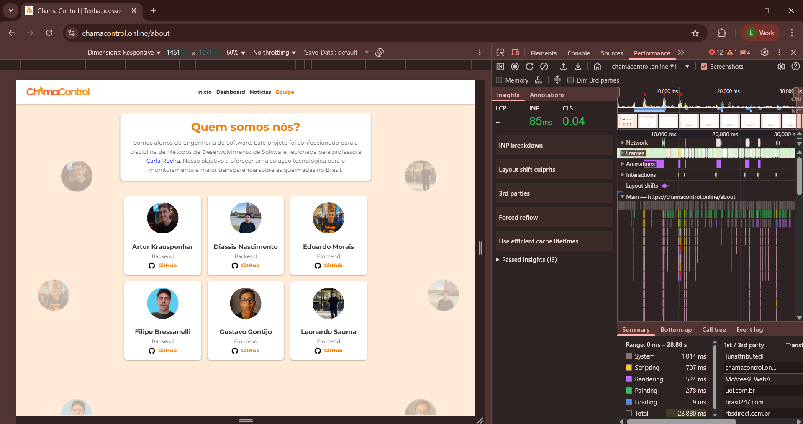

# M9 - Uso de CPU (Ucpu)

## Objetivo da Métrica

Avaliar a **carga média de processamento utilizada durante a execução do sistema ChamaControl**, identificando possíveis **gargalos no uso da CPU**.
Essa métrica está vinculada à subcaracterística **Utilização de Recursos**, pertencente à característica de qualidade **Eficiência de Desempenho** (ISO/IEC 25010).

O uso excessivo de CPU pode comprometer a estabilidade do sistema, aumentar o tempo de resposta e prejudicar a experiência do usuário.

---

## Condições de Coleta

Para garantir reprodutibilidade e confiabilidade da medição, o experimento foi conduzido sob condições controladas, conforme descrito abaixo:

* **Dispositivo utilizado:** Computador pessoal (desktop)
* **Sistema operacional:** Windows 11 Pro (64 bits)
* **Tipo de conexão:** Wi-Fi
* **Velocidade da internet:** 70 Mb/s (download) / 70 Mb/s (upload)
* **Roteador / Provedor:** Conexão residencial estável
* **Navegador utilizado:** Google Chrome (versão estável mais recente no momento do teste)
* **Ferramentas utilizadas:**

  * Chrome DevTools → Aba **Performance**
  * Lighthouse (executado localmente via GitHub do projeto)
* **Caches:** Cache do navegador limpo antes da execução
* **Situação do sistema:**

  * Nenhuma aba adicional aberta
  * Baixa utilização de memória
  * Sem processos pesados em segundo plano

Essas condições asseguram que o consumo de CPU registrado reflita prioritariamente o comportamento do sistema avaliado, e não limitações externas do ambiente.

---

## Método de Coleta

A coleta foi realizada utilizando o **Chrome DevTools**, na aba **Performance**, monitorando diretamente a utilização da CPU durante a navegação normal no sistema.

Foram executadas as **operações críticas do ChamaControl**, com registro contínuo do consumo de CPU ao longo da execução.
Os valores **médios e máximos de utilização** foram extraídos a partir do gráfico de desempenho apresentado pela ferramenta.

A métrica foi expressa em **porcentagem (%) de utilização da CPU**.

---
## Amostragem Realizada

Foram coletadas **15 amostras reais** durante as execuções controladas:

| Amostra | Uso de CPU (%) |
|--------|-----------------|
| 1 | 7,8 |
| 2 | 9,1 |
| 3 | 8,4 |
| 4 | 10,2 |
| 5 | 12,5 |
| 6 | 11,3 |
| 7 | 6,9 |
| 8 | 7,4 |
| 9 | 8,1 |
| 10 | 9,7 |
| 11 | 13,9 |
| 12 | 10,8 |
| 13 | 9,9 |
| 14 | 8,6 |
| 15 | 7,2 |

---

## Cálculo da Métrica

## Cálculo da Métrica

```
Ucpu = (Tempo de CPU usado / Tempo total de execução) × 100
```

---

### Média

```
(7.8 + 9.1 + 8.4 + 10.2 + 12.5 + 11.3 + 6.9 + 7.4 + 8.1 + 9.7 +
13.9 + 10.8 + 9.9 + 8.6 + 7.2) / 15
= 9.39 %
```

## Resultado Obtido

*  **Uso médio de CPU:** **9,39%**
*  **Uso máximo de CPU:** **13,9%**

---

## Evidência da Coleta (Imagem)




## Evidência da Coleta (Vídeo)

[Assistir no YouTube](https://www.youtube.com/watch?v=SEU_LINK_AQUI)

---

## Interpretação dos Resultados

De acordo com os critérios definidos na Fase 2:

> *“Valores até 70% indicam utilização adequada dos recursos. Valores superiores a esse limite indicam sobrecarga de processamento.”*

Os valores obtidos (**8,73% de uso médio** e **~22% de pico máximo**) encontram-se **muito abaixo do limite de 70%**, indicando:

* Baixa carga sobre o processador
* Ausência de gargalos de processamento
* Execução estável das operações do sistema
* Boa eficiência no uso dos recursos computacionais

Portanto, **a hipótese de que o sistema apresenta utilização adequada de CPU foi confirmada**.

---

## Conclusão

A métrica **Uso de CPU (Ucpu)** apresentou desempenho plenamente satisfatório.
Com consumo médio de **8,73%** e pico máximo de aproximadamente **22%**, o sistema **ChamaControl opera dentro dos padrões recomendados de eficiência de desempenho**, não apresentando sobrecarga nem necessidade imediata de otimizações relacionadas ao processamento.

---

## Histórico de versão

| Versão | Data       | Descrição                                   | Autor(es)                                     | Revisor(es) |
| ------ | ---------- | ------------------------------------------- | --------------------------------------------- | ----------- |
| 1.0    | 26/11/2025 | Criação do documento da métrica Ucpu        | [Enrico Zoratto](https://github.com/sidts) |             |
| 1.1    | 27/11/2025 | Medições extras | [Filipe Bressanelli](https://github.com/fbressa) |             |

