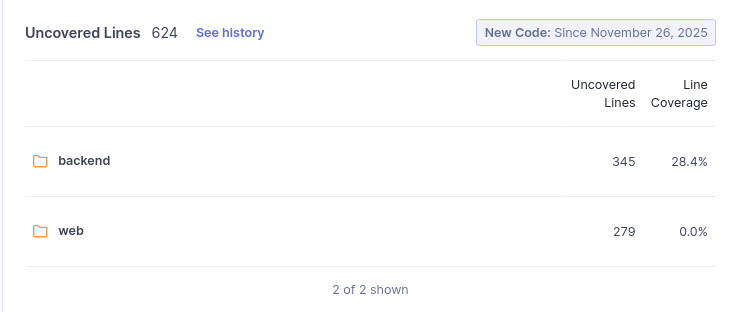

# M5 - Cobertura de Testes Automatizados (CTA)

## 1. Objetivo da Métrica
Avaliar a extensão da cobertura de testes automatizados no sistema **ChamaControl**, verificando se as principais funcionalidades possuem testes suficientes para garantir robustez, prevenir regressões e melhorar a manutenibilidade.  
A métrica está associada à subcaracterística **Testabilidade**, da característica **Manutenibilidade** (ISO/IEC 25010).

---

## 2. Método de Coleta
A coleta foi realizada por meio da ferramenta **SonarQube**, utilizando as seguintes métricas:

- **Coverage (%)**
- **Line Coverage (%)**
- **Lines to Cover**
- **Uncovered Lines**
- **Uncovered Conditions**
- **Coverage Overview (gráfico)**

### Procedimentos:
1. Executar análise do projeto no SonarQube (branch principal).  
2. Navegar até **Measures → Coverage**.  
3. Registrar os valores de cobertura global e por módulo (`backend` e `web`).  
4. Registrar as métricas associadas às linhas não cobertas.  
5. Observar o gráfico **Coverage Overview** para relacionar cobertura × complexidade.

### Condições da Coleta:
- Ambiente: computador pessoal (desktop)  
- Sistema Operacional: Windows 10 Pro (64 bits)  
- Conexão: ethernet cabeada  
- Internet: 70 Mb/s  
- Navegador: Google Chrome 131.0.6778.86  
- Sistema em estado ocioso (sem processos pesados)  
- Cache limpo antes da execução  
- Ferramenta única: SonarQube (última versão disponível no laboratório)

---

## 3. Resultados Obtidos

### 3.1 Visão Geral
- **Coverage geral:** **23,2%**  
- **Line Coverage geral:** **18,0%**  
- **Lines to Cover:** **761**  
- **Uncovered Lines:** **624**  
- **Linhas cobertas:** 137 (17,9% do total)

### 3.2 Cobertura por Módulo

#### **Backend**
- **Line Coverage:** 28,4%  
- **Coverage:** 35,3%  
- **Lines to Cover:** 482  
- **Uncovered Lines:** 345  

O backend possui parte dos testes implementados, resultando em uma cobertura moderada, porém ainda insuficiente.

#### **Web (Frontend)**
- **Line Coverage:** 0%  
- **Coverage:** 0%  
- **Lines to Cover:** 279  
- **Uncovered Lines:** 279  

O frontend não possui nenhum teste automatizado, deixando toda a camada visual e lógica de interação sem proteção.

---

## 4. Coverage Overview (Visão Gráfica)
O gráfico do SonarQube mostra:

- A maioria dos arquivos com **cobertura entre 0% e 5%**
- Arquivos de **alta complexidade ciclomática** com **baixa ou nenhuma cobertura**
- Poucas bolhas com cobertura alta, todas de arquivos simples e pouco relevantes

---

## 5. Imagens de Evidência

### **Coverage (%)**

### **Line Coverage**

### **Uncovered Lines**

### **Lines to Cover**

### **Coverage Overview (gráfico)**

---

## 6. Interpretação dos Resultados

Com base nos limites definidos na [Fase 2](../../../Fase%202/index.md):

- **≥ 80%** → excelente  
- **60–79%** → adequado  
- **< 60%** → insuficiente  

O projeto apresenta:

- **23,2% de Coverage geral**  
- **18% de Line Coverage geral**  

Logo, a testabilidade do sistema é considerada **baixa**.

Principais pontos:

- O **backend** possui alguma cobertura (28,4%), mas longe do ideal.  
- O **frontend** não possui cobertura alguma **(0%)**, incluindo arquivos críticos como `Dashboard.jsx`.  
- Alta quantidade de linhas não cobertas (**624**), prejudicando confiança e previsibilidade do sistema.  
- A baixa cobertura combinada com alta complexidade em alguns arquivos aumenta a probabilidade de regressões.  

---

## 7. Ligação Questão–Hipótese

### **Q5:**  
“*O código permite a criação e execução eficiente de testes automatizados?*”

### **Hipótese H5:**  
“*As funções principais possuem cobertura ≥ 80%.*”

### **Resultado:**  
A hipótese foi **refutada**.

O nível atual de cobertura não evidencia criação eficiente de testes. O percentual está muito abaixo do mínimo desejável e o frontend está completamente sem testes.

---

## 8. Conclusão

A métrica **Cobertura de Testes Automatizados (CTA)** demonstra que:

- Apenas o backend possui testes, mas insuficientes.  
- O frontend está totalmente sem cobertura.  
- Apenas **137** de **761** linhas estão cobertas.  
- O projeto apresenta **baixa testabilidade**, exigindo priorização urgente de testes.

Recomenda-se:

- Implementar testes unitários e de integração no backend  
- Criar testes para componentes React  
- Priorizar arquivos de alta complexidade ciclomática  
- Automatizar testes de rotas principais e fluxos críticos

---

## 9. Evidência da Coleta (Vídeo)
<iframe width="930" height="523" src="https://www.youtube.com/embed/a5cbs4alqqs" title="Cobertura de Testes Automatizados (CTA)" frameborder="0" allow="accelerometer; autoplay; clipboard-write; encrypted-media; gyroscope; picture-in-picture; web-share" referrerpolicy="strict-origin-when-cross-origin" allowfullscreen></iframe>

## 10. Histórico de Versão

| Versão | Data | Descrição | Autor(es) | Revisor(es) |
|--------|------------|------------------------------|-------------------------------|----------------|
| 1.0 | 27/11/2025 | Criação do documento | [Leonardo Sauma](https://github.com/leohssjr) |  |
| 1.1    | 28/11/2025 | Adição do vídeo                                                                                        | [Leonardo Sauma](https://github.com/leohssjr) |                                            |
