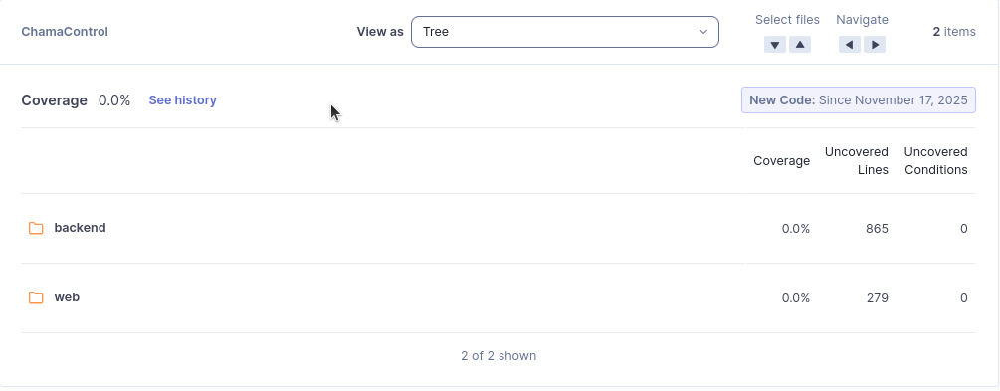
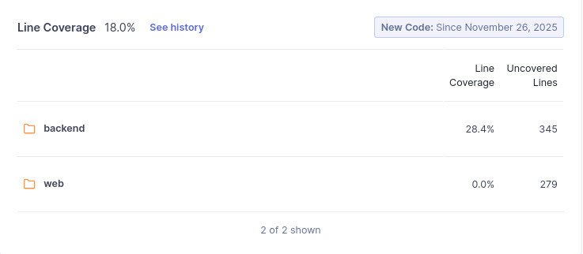

# Cobertura de Testes Automatizados (CTA) — Análise dos Resultados no SonarQube

## 1. Objetivo da Métrica
Avaliar o nível de cobertura de testes automatizados no código do ChamaControl, verificando se as funcionalidades principais estão sendo exercitadas por testes que garantem a qualidade, diminuem regressões e facilitam manutenção.

A métrica CTA se relaciona diretamente à subcaracterística **Testabilidade**, dentro da **Manutenibilidade** da ISO/IEC 25010.

---

## 2. Método de Coleta
A coleta foi realizada via **SonarQube**, utilizando os seguintes indicadores:

- **Coverage (%)**
- **Line Coverage (%)**
- **Lines to Cover**
- **Uncovered Lines**
- **Coverage Overview** (gráfico gerado pelo SonarQube)

Procedimento:

1. Acessar o projeto *ChamaControl* no SonarQube.  
2. Navegar em **Measures → Coverage**.  
3. Registrar o *Coverage (%)*  
4. Registrar o *Line Coverage (%)*  
5. Registrar o *Lines to Cover*  
6. Registrar o *Uncovered Lines*  
4. Registrar o gráfico **Coverage Overview**, que relaciona complexidade ciclomática × cobertura.  

Condições da coleta:

- Branch analisado: `main`
- Data da coleta: 24/11/2025
- Novo código analisado desde: 17/11/2025
- Ausência de integração de relatórios de cobertura (LCOV, Jest, etc.)

---

## 3. Resultado Obtido

### Lines to Cover

- Total: **1.144 linhas**
- Backend: **865**
- Web: **279**

---

### Coverage (%)

- Cobertura total: **0.0%**
- Backend: **0.0%** (865 linhas descobertas)
- Web: **0.0%** (279 linhas descobertas)

---

### Coverage Overview

> Observação: Todas as bolhas estão na faixa de **0% de cobertura**, indicando ausência de testes instrumentados.

---

### Line Coverage

- Line Coverage total: **0.0%**

---

### Uncovered Lines

- Total de linhas não cobertas: **1.144**
- Backend: **865**
- Web: **279**

---

## 4. Interpretação dos Resultados
A análise consolidada das métricas mostra que:

### Linhas a serem testadas existem (1.144 linhas)  
Isso significa que o SonarQube reconheceu estruturas de código passíveis de teste.

### Cobertura = **0%**  
Todas as métricas de cobertura apresentam **zero**:

- Coverage (%) = **0.0%**  
- Line Coverage (%) = **0.0%**  
- Uncovered Lines = **100% das lines to cover**  
- Coverage Overview = todas as bolhas no eixo dos 0%

Isso confirma que:

> **Nenhum teste automatizado foi detectado ou executado com relatório de cobertura integrado.**

Ou seja:

- Pode existir testes manuais  
- Pode existir testes automatizados **sem relatório LCOV**  
- Mas o SonarQube não recebeu nenhum dado de cobertura (LCOV, XML, etc.)

### Consequências para a qualidade:
- A testabilidade prática não é verificada  
- Riscos maiores de regressões  
- Dificuldade de validar hipóteses que dependem de testes  
- Baixa confiabilidade estrutural do código  

---

## 5. Ligação entre a questão e a hipótese

### Questão GQM Q5  
"**O código permite a criação e execução eficiente de testes automatizados?**"

### Hipótese 5  
"**As funções principais possuem cobertura de teste automatizado superior a 80%.**"

### Análise da hipótese com base na coleta
- Cobertura medida = **0%**
- Linhas totalmente não cobertas = **1.144**
- Não há nenhum arquivo com cobertura > 0%

### Conclusão da hipótese
A hipótese é **refutada**.

> **Com 0% de cobertura, não há evidência de que os testes automatizados existem ou exercitam qualquer funcionalidade do sistema.**

---

## 6. Evidência da Coleta (Vídeo)

> Link do vídeo.

## Histórico de versão
| Versão | Data       | Descrição                                                                                                         | Autor(es)                                        | Revisor(es)                                |
| ------ | ---------- | ----------------------------------------------------------------------------------------------------------------- | ------------------------------------------------ | ------------------------------------------ |
| 1.0    | 17/11/2025 | Criação do documento                                                                                        | [Leonardo Sauma](https://github.com/leohssjr), [Gabriel Soares](https://github.com/SAnjos3) |                                            |