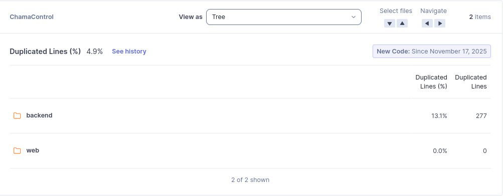

# M4 - Percentual de Código Duplicado (DUP)

## 1. Objetivo da Métrica
Avaliar a taxa de duplicação de código dentro do ChamaControl, identificando blocos idênticos ou muito semelhantes.  
A duplicação reduz a **reutilização**, aumenta o **esforço de manutenção** e pode gerar inconsistências quando alterações não são aplicadas em todos os pontos copiados.

Esta métrica está relacionada à subcaracterística **Reutilização**, dentro da **Manutenibilidade** (ISO/IEC 25010).

---

## 2. Método de Coleta
A coleta foi realizada por meio da ferramenta **SonarQube**, analisando o indicador:

- **Duplicated Lines (%)**

Procedimento de coleta:

1. Acessar o projeto **ChamaControl** no SonarQube.  
2. Navegar até **Measures → Duplications**.  
3. Registrar o percentual geral de linhas duplicadas
4. Registrar a distribuição por módulo (backend e web)
5. Registrar a quantidade absoluta de linhas duplicadas
4. Considerar apenas o código desde o marco configurado: *New Code Since: 17/11/2025*.

Condições da coleta:

- Branch analisado: `main`
- Data da coleta: 24/11/2025
- Regras e perfis padrão do SonarQube
- Comparação automática entre arquivos feita pelo próprio engine do Sonar

---

## 3. Resultado Obtido

### Duplicated Lines (%)

**Valores globais:**

- Percentual geral do projeto: **4.9%**

**Por módulo:**

- Backend: **13.1%** (277 linhas duplicadas)  
- Web: **0.0%** (0 linhas duplicadas)

---

## 4. Interpretação dos Resultados

### Análise geral
O valor global de **4.9%** está **abaixo de 10%**, o que, segundo a interpretação definida na [Fase 2](../../../Fase%202/index.md), indica:

- Boa reutilização do código  
- Baixo risco de inconsistências  
- Redução do custo de manutenção  

Esse percentual demonstra que, no geral, o sistema mantém um bom nível de organização e reaproveitamento.

### Análise por módulo

#### **Backend — 13.1%**
- Acima do limite ideal (<10%)  
- Indica que existem blocos repetidos que podem ser abstraídos, refatorados ou movidos para funções reutilizáveis  
- Pode afetar a manutenibilidade e aumentar o esforço de correção futura  
- Sugere a necessidade de revisão dos arquivos com maior duplicação

#### **Web — 0%**
- Sem nenhuma duplicação detectada  
- Excelente estado em termos de reutilização  
- Indica que o frontend foi projetado de forma mais modular e com estruturas reutilizáveis

---

## 5. Ligação entre a Questão e a Hipótese

### Questão GQM Q4  
"**Existe duplicação de código ou funções repetidas que possam dificultar a manutenção?**"

### Hipótese 4:  
"**Menos de 10% do código é duplicado, permitindo maior facilidade de manutenção e evolução.**"

### Validação da Hipótese
- Valor global: **4.9% > CONFIRMA A HIPÓTESE**
- Backend ultrapassa 10% (13.1%), mas:
    - a métrica considera o total do sistema
    - a análise GQM é feita no nível do projeto

### Conclusão da Hipótese
A hipótese é **confirmada**, pois o percentual total do código duplicado (4.9%) está dentro do limite estabelecido.  
Entretanto, recomenda-se uma ação de melhoria no módulo **backend**, que concentra praticamente toda duplicação.

---

## 6. Evidência da Coleta (Vídeo)
<iframe width="930" height="523" src="https://www.youtube.com/embed/wsPosmhyJSE" title="Percentual de Código Duplicado (DUP)" frameborder="0" allow="accelerometer; autoplay; clipboard-write; encrypted-media; gyroscope; picture-in-picture; web-share" referrerpolicy="strict-origin-when-cross-origin" allowfullscreen></iframe>

## Histórico de versão
| Versão | Data       | Descrição                                                                                                         | Autor(es)                                        | Revisor(es)                                |
| ------ | ---------- | ----------------------------------------------------------------------------------------------------------------- | ------------------------------------------------ | ------------------------------------------ |
| 1.0    | 17/11/2025 | Criação do documento                                                                                        | [Leonardo Sauma](https://github.com/leohssjr), [Gabriel Soares](https://github.com/SAnjos3) |                                            |