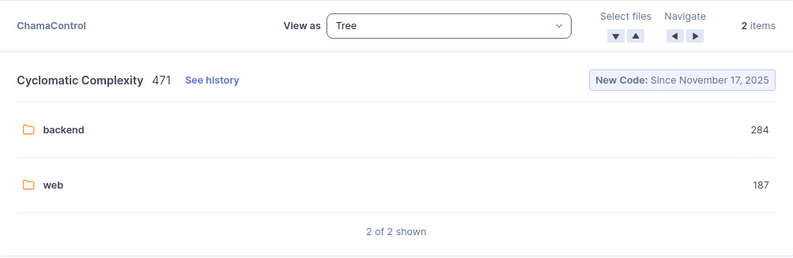

# M6 - Complexidade Ciclomática Média (CCM) 

## 1. Objetivo da Métrica
Avaliar o nível de complexidade lógica do ChamaControl por meio dos valores fornecidos pelo SonarQube.  
A complexidade ciclomática indica a quantidade de caminhos independentes no código, influenciando diretamente:

- A facilidade de compreensão do sistema  
- O esforço de manutenção e evolução  
- A necessidade e dificuldade de criação de testes automatizados  

A métrica está ligada às subcaracterísticas **Analisabilidade** e **Modificabilidade** da ISO/IEC 25010.

---

## 2. Método de Coleta
A análise foi feita exclusivamente pelos indicadores fornecidos automaticamente pelo **SonarQube**, sem cálculos manuais.

Foram coletados os seguintes valores:

- **Cyclomatic Complexity (total)**  
- Complexidade por módulo (`backend` e `web`)  
- *Cognitive Complexity* (indicador complementar de legibilidade)  
- *Code Smells* relacionados a estruturas de decisão complexas

Procedimento:

1. Acessar o projeto no SonarQube  
2. Navegar para **Measures → Complexity → Cyclomatic Complexity**  
3. Registrar os valores por módulo e o total consolidado  
4. Analisar o nível de complexidade visível no relatório

Condições:

- Branch: `main`  
- Data: 24/11/2025  
- Novo código considerado desde 17/11/2025  

---

## 3. Resultado Obtido

### Cyclomatic Complexity (Total)

- **Complexidade Total:** 471

**Distribuição por módulo:**
- Backend: **284**
- Web: **187**

---

## 4. Interpretação dos Resultados

### Interpretação geral
O valor total de **471** indica um sistema com complexidade considerável.  
Valores altos sugerem:

- maior número de caminhos lógicos  
- necessidade maior de testes  
- maior esforço de manutenção  
- potencial para funções extensas ou com muitas decisões

### Backend - 284
- Concentra a maior parte da complexidade  
- Regras de negócio provavelmente contêm estruturas condicionais extensas  
- Deverá ser priorizado em futuras refatorações

### Web - 187
- Também apresenta complexidade relevante  
- Pode refletir componentes com múltiplos fluxos de interação

### Sobre a CCM
Como o SonarQube **não fornece automaticamente o número de funções analisadas**, a **média exata (CCM)** não pôde ser calculada.

Assim, a análise assume exclusivamente os valores fornecidos pelo SonarQube.

---

## 5. Ligação entre Questão e Hipótese

### Questão GQM Q6  
"**O nível de complexidade do código impacta a facilidade de manutenção e evolução?**"

### Hipótese 6  
"**As funções apresentam complexidade ciclomática média inferior a 10.**"

### Avaliação da hipótese
- Não foi possível obter a média exata devido aos dados disponíveis.  
- Contudo, a complexidade total elevada (**471**) sugere que partes do sistema ultrapassam limites ideais.  
- Assim, **não há evidência para confirmar a hipótese**.  
- A hipótese, portanto, **é considerada não atendida**.

---

## 6. Evidência da Coleta (Vídeo)
<iframe width="930" height="523" src="https://www.youtube.com/embed/HFsOQhOxXd8" title="Complexidade Ciclomática Média (CCM)" frameborder="0" allow="accelerometer; autoplay; clipboard-write; encrypted-media; gyroscope; picture-in-picture; web-share" referrerpolicy="strict-origin-when-cross-origin" allowfullscreen></iframe>

## Histórico de versão
| Versão | Data       | Descrição                                                                                                         | Autor(es)                                        | Revisor(es)                                |
| ------ | ---------- | ----------------------------------------------------------------------------------------------------------------- | ------------------------------------------------ | ------------------------------------------ |
| 1.0    | 17/11/2025 | Criação do documento                                                                                        | [Leonardo Sauma](https://github.com/leohssjr), [Gabriel Soares](https://github.com/SAnjos3) |                                            |
| 1.1    | 28/11/2025 | Adição do vídeo                                                                                        | [Leonardo Sauma](https://github.com/leohssjr) |                                            |