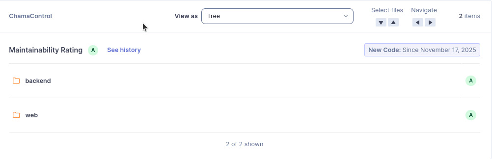

# M1 - Grau de Modularidade (GM)

## 1. Objetivo da Métrica
Avaliar se o ChamaControl possui **módulos bem definidos, organizados e com responsabilidades claras**, garantindo boa manutenibilidade, facilidade de evolução e menor impacto entre componentes.  
Esta métrica está diretamente associada à subcaracterística **Modularidade**, dentro da característica **Manutenibilidade** do modelo ISO/IEC 25010.

---

## 2. Método de Coleta
A coleta foi realizada na ferramenta **SonarQube**, utilizando os indicadores:

- Maintainability Rating (A–E)
- Technical Debt Ratio (%)

Procedimento:

1. Abrir o projeto **ChamaControl** no SonarQube.  
2. Navegar até **Measures > Maintainability**.  
3. Registrar o rating geral do projeto
4. Registrar o rating individual por módulo (backend e web)
5. Navegar para **Measures > Debt Ratio**.  
6. Registrar o **Technical Debt Ratio** apresentado em cada módulo.

Condições de coleta:

- Branch analisado: `main`
- Data da coleta: 24/11/2025
- Novo código considerado desde: 17/11/2025
- Configuração padrão do SonarQube sem regras customizadas

---

## 3. Resultado Obtido

### Maintainability Rating

- Projeto: **A**
- Backend: **A**
- Web: **A**

### Technical Debt Ratio

- Projeto: **0.2%**
- Backend: **0.2%**
- Web: **0.2%**

---

## 4. Interpretação dos Resultados

### Maintainability Rating
O rating **A** representa o melhor nível na escala do SonarQube, indicando:

- Código com baixa quantidade de *code smells*  
- Boa organização interna  
- Baixo esforço estimado para corrigir problemas  
- Estrutura modular adequada para manutenção  

Ter ambos os módulos (**backend e web**) com rating **A** reforça que o sistema está bem segmentado, com responsabilidades claras.

---

### Technical Debt Ratio
O valor de **0.2%** é extremamente baixo. Segundo o SonarQube:

- Valores abaixo de **5%** já indicam excelente saúde do código  
- 0.2% sugere um sistema praticamente sem dívidas de manutenção  
- Reforça que a modularidade está permitindo evolução e manutenção com pouco esforço

---

## 5. Ligação entre a Questão e a Hipótese

### Questão GQM Q1 
"**O código do ChamaControl é modular?**"

### Hipótese 1
"**Mais de 80% das funções estão agrupadas de forma coerente e com responsabilidade clara.**"

### Análise da Hipótese
- Maintainability Rating: **A**
- Technical Debt Ratio: **0.2%**
- Ambos os módulos backend e web apresentam a mesma qualidade elevada

### Conclusão da Hipótese
Os indicadores do SonarQube **confirmam totalmente a hipótese**.  
O sistema é modular, bem organizado e exige baixíssimo esforço para manutenção.

---

## 6. Evidência da Coleta (Vídeo)

<iframe width="1425" height="570" src="https://www.youtube.com/embed/XzDBKjXr3Pg" title="Grau de Modularidade (GM)" frameborder="0" allow="accelerometer; autoplay; clipboard-write; encrypted-media; gyroscope; picture-in-picture; web-share" referrerpolicy="strict-origin-when-cross-origin" allowfullscreen></iframe>

## Histórico de versão
| Versão | Data       | Descrição                                                                                                         | Autor(es)                                        | Revisor(es)                                |
| ------ | ---------- | ----------------------------------------------------------------------------------------------------------------- | ------------------------------------------------ | ------------------------------------------ |
| 1.0    | 17/11/2025 | Criação do documento                                                                                        | [Leonardo Sauma](https://github.com/leohssjr), [Gabriel Soares](https://github.com/SAnjos3) |                                            |
| 1.1    | 28/11/2025 | Adição do vídeo                                                                                        | [Leonardo Sauma](https://github.com/leohssjr) |                                            |